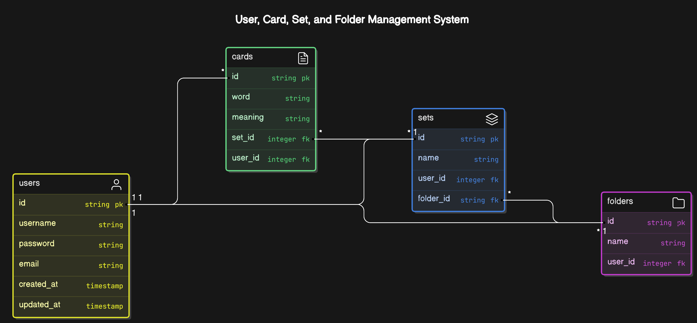

# CS50 WEB FINAL PROJECT: FLASHCARD

The project video is: https://youtu.be/xvvzbSW1uik

## Introduction:
Hi, my name is Nguyen. This is my final project for my CS50 Web course. The idea came to me when I was studying English using the flashcard method using some websites online. But all of them have limitations for free accounts, making me uncomfortable. So I decided to build this small web app to service myself :D. At the time I submit this project, I think it doesn't have a full function for a learning page but I believe I will complete it someday.Hope you guys like it.

# Main idea:

I created a Flashcard web application to learn things using flashcards. Users can create folders, sets, cards and start learning. The main components are:

* Homepage
* Login/Logout/Register
* The Create Set page for user to create a set and add cards to their set
* The Folder page shows all the sets that belong to a specific folder
* The Set page is the main page for users to learn using flashcard
* The About page is some introduction to this project

## Distinctiveness and Complexity:
Why do I believe my project satisfies the distinctiveness and complexity requirements?:
* It is different from all other projects in this course
* It uses more models and complex relationships between them than the projects we have done.
* It is completely Mobile responsive.
* Uses JavaScripts to fetch data without reloading the page.
Aside from the differences, this web application still uses the knowledge gained throughout the course.

## Files and Directories
* `Main directory`
   * `flashcard` Main application directory
      *
      * In `views.py` there are all the backend codes. The main functions are:
          * **login_view**, **logout_view**, and **register** functions for authentication services
          * **index** return the homepage or redirect the user to the login page if a user is not authenticated
          * **create_folder** is used for creating a folder
          * **create_set** is used for creating a set and cards related to this
          * **folder** return folder page which represents information about a specific folder
          * **search** receives query and filter folder and set based on their title then returns the homepage with a list of folders and sets related to this
          * **add_set_to_folder**, **remove_set_from_folder** is used to add or remove set(s) to a specific folder
          * **delete_folder**, **delete_set** is used to delete a specific folder or set
          * **set** return set page which is the main page for user to learn things using flashcards
          * **get_card** API function returns a list of cards belonging to a particular set.
          * **about** return about page

      * `Models.py` has four models which are:
          * *user* model represents for users using this web app
          * *folder* model represents for folders in this web app
          * *set* model represents for sets in this app
          * *card* model represents the cards that belong to a set in this app
          * The image below shows the ER diagram of the database:

          
      * `urls.py` contains all the routes of this flashcard web app
      * `static/flashcard/assets` holds all static files of the flashcard application:
          * `css` contains all css files for styling the website.
            * `style.css` styling all the pages of this web app
          * `img` contains all images used for this web app
          * `js` contains all JavaScript files for manipulating the DOM
            * `index.js` contains all JavaScript codes
      * `templates/flashcard` templates for all of the different HTML pages (8 in total including a layout file)
  * `media/img` holds all the images that users upload to the website
  * Other less important files like admin, settings,...

## How to run the application
* Install project dependencies by running *pip install -r requirements.txt*
* Make and apply migrations by running *python manage.py makemigrations* and *python manage.py migrate.*
* Finally, running  *python manage runserver* to run the project*
